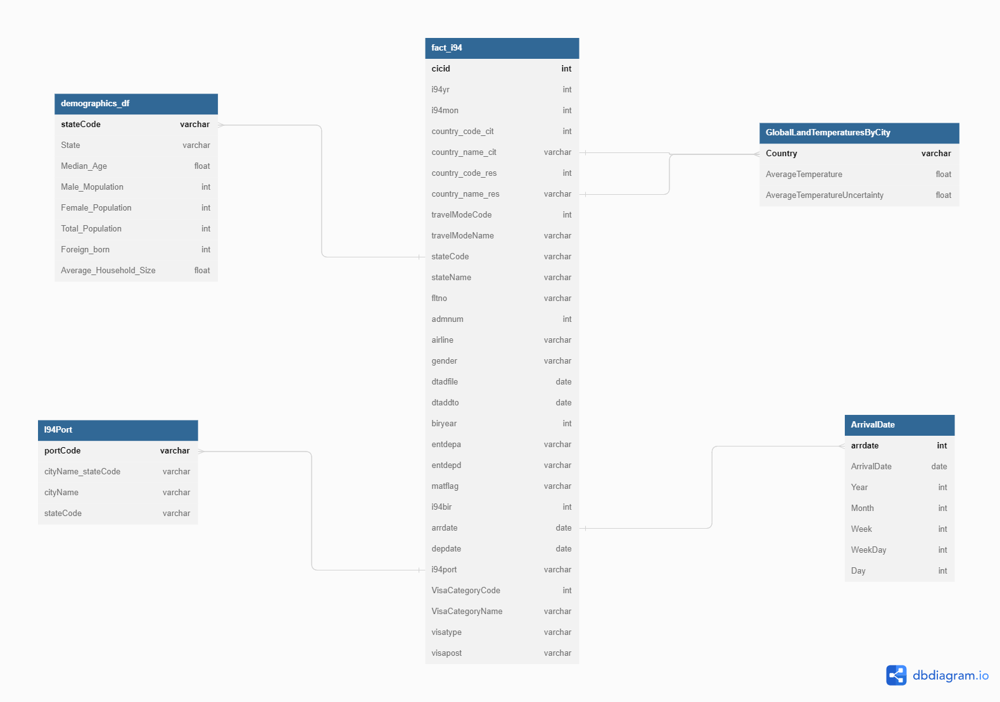

## Technologies
* Python
* Apache Spark 
* Pandas ,Re , UDF

## Project Summary

* This project aims to create a schema that can derive various correlations using three datasets, demographics of US states and cities dataset, global temperature data of countries dataset and i94 immigration dataset. For example, is there any correlation beetween the average temperature of residence country and going to united state.

> The project follows the follow steps:

* Step 1: Scope the Project and Gather Data
* Step 2: Explore and Assess the Data
* Step 3: Define the Data Model
* Step 4: Run ETL to Model the Data
* Step 5: Complete Project Write Up

## Datasets 
- I94 Immigration Data: This data comes from the US National Tourism and Trade Office. A data dictionary is included in project, [this](https://www.trade.gov/national-travel-and-tourism-office) is where the data comes from.
- World Temperature Data: This dataset came from Kaggle. You can read more about it [here](https://www.kaggle.com/datasets/berkeleyearth/climate-change-earth-surface-temperature-data).
- U.S. City Demographic Data: This data comes from OpenSoft. You can read more about it [here](https://public.opendatasoft.com/explore/dataset/us-cities-demographics/export/).
- Airport Code Table: This is a simple table of airport codes and corresponding cities. It comes from [here](https://datahub.io/core/airport-codes#data).

## Scope of the Project
### The steps to create the analytics model database: 
- Use pandas and Spark python dataframe to load the data
- Explore I94 immigration dataset to identify missing values and perform data cleaning
- Explore demographics dataset to identify missing values and perform data cleaning
- Explore temperatures dataset by country to identify missing values and perform data cleaning
- Extract Port, Country , State, Visa and Mode of travel from sas_label file and perform join with I94 dataset
- Create star schema
    - Dimension tables :
        1. Extract and create ArrivalDate dimension from i94 dataset, this dimension can join the fact table through the arrdate feature. 
        2. Extract and create I94Port dimension from i94 sas_label file, this dimension can join the fact table through the i94port feature.
        3. Create demographics_df dimension from the us_cities_demographics dataset. This dimension can join the fact table through the stateCode feature.
        4. Create GlobalLandTemperaturesByCity dimension from the GlobalLandTemperaturesByCity dataset. This dimension can join the fact table through the Country feature.
        
    - Create the fact table from the cleaned I94 dataset.

-  Apache Spark is the technology that used in this project

## Conceptual Data Model

- The travellers flow is my main interest, thus fact_i94 table is my fact table.

- demographics_df dimension table : this dimension table is the demographical details of travellers flow based on States of US and created from the us_cities_demographics dataset. This dimension can join the fact table through the stateCode feature.

- GlobalLandTemperaturesByCity dimension table: this dimension table is the temperatures  of travellers flow based on thier origin and destination countries and created from the GlobalLandTemperaturesByCity dataset. This dimension can join the fact table through the Country feature.

- ArrivalDate dimension table: this dimension table is the datetime details of travellers flow based on thier Arrival and extracted and created from the i94 dataset. This dimension can join the fact table through the i94port feature.

- I94Port dimension table: this dimension table is airport details of travellers flow based on State and city and this table extracted from the i94 sas_label file. This dimension can join the fact table through the i94port feature.

## Mapping Out Data Pipelines

1. Clean data by dropping columns with 80% percentage of null values or more 
2. Fill the null values based on another columns 
3. Load the data into staging tables
4. Create Dimension tables
5. Create Fact table
6. Write data into parquet files
7. Perform data quality checks
